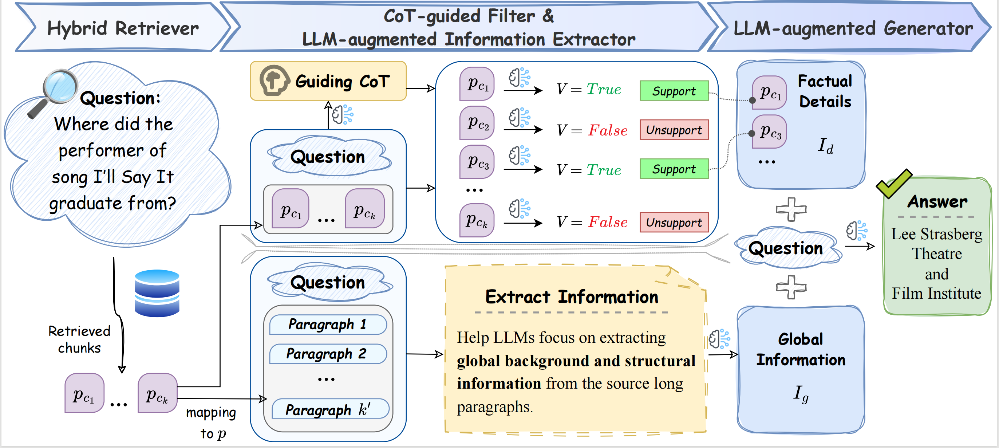

# LongRAG: A Dual-perspective Retrieval-Augmented Generation Paradigm for Long-Context Question Answering

**LongRAG** LongRAG is a general, dual-perspective, and robust LLM-based RAG system paradigm for LCQA to en-hance RAG’s understanding of complex long-context knowledge (i.e., global information and factual details)




## ⚙️ Environmental Setup
Install the requirements with pip: `pip install -r requirements.txt`. We recommend using FlashAttention 2 for optimization and saving GPU memory. The relevant dependencies can be installed according to the code base of [FlashAttention](https://github.com/Dao-AILab/flash-attention).


## ⚙️ Data Preparation

Our raw training data comes from [HotpotQA,2WikiMultihopQA,MuSiQue](https://github.com/StonyBrookNLP/ircot) and [Qasper](https://allenai.org/data/qasper). The evaluation data and the corresponding retrieval corpus raw data are sourced from [LongBench](https://github.com/THUDM/LongBench).

We have standardized the data format for the aforementioned datasets. You can download our standardized raw datasets by running the following command:

```bash
bash download/raw_data.sh
```

The data will be downloaded in the `data/`.


### Data Processing

Build the LRGinstruction dataset for SFT:

```bash
cd src
python gen_instruction.py --per_task_num 200 --min_res_tokens 20 --long_ratio 0.2
```

Save the processed data in `data/train/processed`.

Build an index for retrieval and save the mapping relationship between chunks and the original text:

```bash
cd src
python gen_index.py --dataset hotpotqa --chunk_size 200 --min_sentence 2 --overlap 2
```

Save the processed data in `data/corpus/processed`.

## 🖥️ LongRAG Training

First, you need to download [LLaMA-Factory](https://github.com/hiyouga/LLaMA-Factory/tree/v0.6.3) to our project. Then put our constructed instruction data into `LLaMA-Factory/data` and add the following entry to `dataset_info.json`:

```json
"LRGinstruction": {
  "file_name": "LRGinstruction.json",
  "columns": {
    "prompt": "instruction",
    "query": "input",
    "response": "output"
  }
}
```

Then run the following script to start fine-tuning:

```bash
cd scripts
bash sft.sh $model_name_or_path $template $cutoff_len
```

`model_name_or_path` should correspond to the [template](https://github.com/hiyouga/LLaMA-Factory/tree/v0.6.3), and `cutoff_len` is the truncation length.

## 📊 Evaluation

Here are some example scripts for performing inference and evaluation on HotpotQA. To get started, first navigate to the `src` directory.

### Using different methods

We provide examples of inference using the ChatGLM3-6B-32k model.

**LongRAG-ChatGLM3-6B-32k (without SFT)**:
```bash
CUDA_VISIBLE_DEVICES=0 python main.py --dataset hotpotqa --model chatGLM3-6b-32k --rb --rl --ext --fil --ext_fil 
```

**LongRAG-ChatGLM3-6B-32k (with SFT)**:
```bash
CUDA_VISIBLE_DEVICES=0 python main.py --dataset hotpotqa --model LongRAG-chatglm3-32k --rb --rl --ext --fil --ext_fil 
```

### Component Transferability

Using only the Extractor, with the generator using GPT-3.5-turbo and the Extractor using LongRAG-chatglm3-32k:
```bash
CUDA_VISIBLE_DEVICES=0,1 python main.py --dataset hotpotqa --model gpt-3.5-turbo --lrag_model LongRAG-chatglm3-32k --ext 
```

Using only the Filter, with the generator using GPT-3.5-turbo and the Filter using LongRAG-chatglm3-32k:
```bash
CUDA_VISIBLE_DEVICES=0,1 python main.py --dataset hotpotqa --model gpt-3.5-turbo --lrag_model LongRAG-chatglm3-32k --fil 
```

Using both Extractor & Filter, with the generator using GPT-3.5-turbo and both the Extractor & Filter using LongRAG-chatglm3-32k:
```bash
CUDA_VISIBLE_DEVICES=0,1 python main.py --dataset hotpotqa --model gpt-3.5-turbo --lrag_model LongRAG-chatglm3-32k --ext_fil 
```

Note: The parameters `--rb`, `--rl`, `--ext`, `--fil`, and `--ext_fil` represent running RAG-Base, RAG-Long, Extractor, Filter, and Extractor & Filter, respectively. These parameters can be combined arbitrarily.

Evaluation results will be saved in the `log` directory.

### Evaluation Result on Each Dataset
Below are partial experimental results, showcasing the F1 scores on three multi-hop datasets from [LongBench](https://github.com/THUDM/LongBench), using the LongRAG paradigm.
> Note: Following the LongBench settings, for text that exceeds the model's processing length, we truncate it from the middle of the text and retain the beginning and end information.

|                   | HotpotQA | 2WikiMultiHopQA  | MusiQue |Avg |
| ----------------- | :-----------: | :----------: | :-----------: | :-----: |
| LongRAG-Qwen-1.5-7B-32k w/ SFT| 52.91 | 46.65 | 31.85 | 43.80 |
| LongRAG-Llama3-8B-8k w/ SFT| 52.39 | 49.67 | 31.70 | 44.59 |
| LongRAG-Vicuna-v1.5-7B-16k w/ SFT| 55.55 | 50.13 | 28.29 | 44.66 |
| LongRAG-ChatGLM3-6B-32k w/ SFT| 55.93 | 54.85 | 33.00 | 47.93 |
| LongRAG-GPT-3.5-Turbo w/o SFT| 56.17 | 51.37 | 32.83 | 46.79 |
| LongRAG-GPT-3.5-Turbo-16k w/o SFT| 59.11 | 51.25 | 30.37 | 46.91 |
| LongRAG-GLM-4 w/o SFT| 62.11 | 57.16 | 38.40 | 52.56 |
